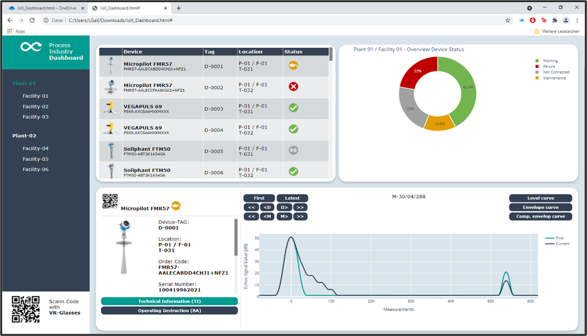
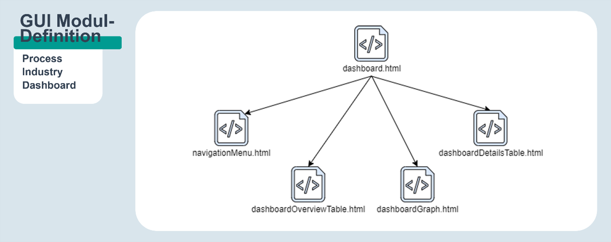
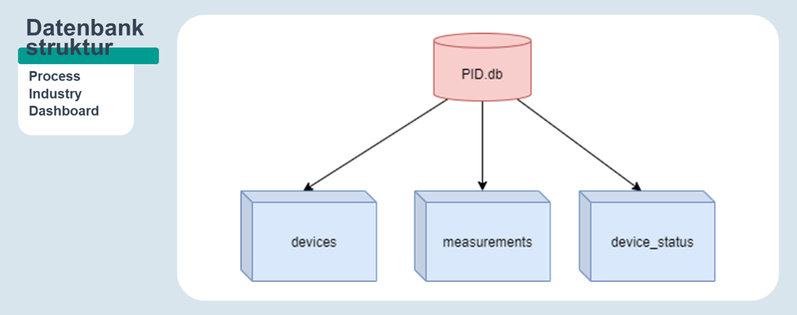

# IoX_Web_App
The following repo inherits the exam project of the course IoX Coding Innovation including this work as well as an essay with further specification.

The present work/code is open source for IoX Lab (iox.institute).

## Basic Structure of the Architecture
The following image is describing the structure of the graphical user interface (GUI) in form of a web application set up in python.

To further define the implementation process regarding modularity, the structure is alligned according to the image:

## Basic Structure of the Database

The used database uses the SQLite framework which is in the scope of rapid programming the best solution in combination with limited data. For an implementation under real conditions, the usage of SQL or even No-SQL databases (or even combinations from both) must be evaluated. However, the current implementation follows the simple structure defined in the image below:

## Additional

For further explanations and definitions, see the essay profided to the IoX Lab.
